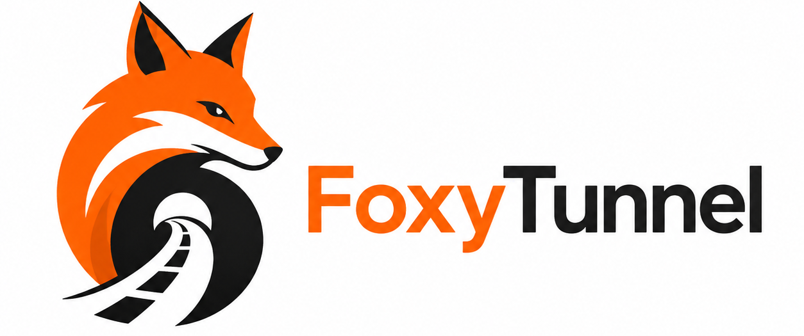

<p align="center">
  
</p>

<p align="center">
  <strong>A small cross-platform desktop control panel for running a local Tor SOCKS proxy.</strong>
</p>

<p align="center">
  
  
  
  
</p>

# FoxyTunnel

FoxyTunnel is a Rust/Tauri desktop app that starts and controls a local
Arti-powered Tor SOCKS5 proxy. It is designed for users who want a compact
desktop control surface for Tor routing without pretending to be a full VPN or
whole-system tunnel.

The current app focuses on Windows and Linux desktop usage with a native
window, a tray icon for quick show/hide actions, persistent settings, disk
logs, and a small Tor Control panel.

## Features

- Start and stop a local SOCKS5 proxy backed by Arti.
- Copy the local proxy endpoint, defaulting to `127.0.0.1:19050`.
- Verify the active route through Tor Check from inside the app.
- Select a strict Tor exit country from a fixed list.
- Configure bootstrap timeout and connection logging.
- Save desktop settings across launches.
- Write live activity logs to disk while keeping the on-screen log clearable.
- Reset Tor runtime state/cache without deleting user settings.
- Use the tray icon to hide, restore, or quit the app.

## Current Scope

FoxyTunnel is not a VPN and does not currently route all system traffic. The
main supported path is applications configured to use FoxyTunnel's local SOCKS5
endpoint.

UDP and ICMP are not supported by the SOCKS proxy. DNS should be sent through
SOCKS-aware applications using remote hostname resolution, for example
`socks5h://127.0.0.1:19050`.

## Desktop Behavior

The desktop app now uses a normal native system window on Windows and Linux.
Closing the window hides it to the tray instead of quitting the process. Use the
tray menu's `Quit` action to fully exit FoxyTunnel.

When the proxy is running, settings that affect the active runtime are locked.
Stop the proxy before changing the port, exit country, bootstrap timeout, or
Tor runtime data.

## Development

Install a recent Rust toolchain, Node.js, npm, and the native dependencies
required by Tauri on your platform.

Run the desktop app:

```bash
cd apps/desktop
npm install
npm run tauri -- dev
```

Run the workspace checks:

```bash
cargo fmt --check
cargo test --workspace
cargo clippy --workspace --all-targets -- -D warnings
cd apps/desktop
npm run build
npx tsc --noEmit
```

Run the CLI helper:

```bash
cargo run -p foxytunnel-app
cargo run -p foxytunnel-app -- --bootstrap
cargo run -p foxytunnel-app -- --socks
cargo run -p foxytunnel-app -- --socks --port 19051 --log
```

## Building

Linux desktop build:

```bash
cd apps/desktop
npm run tauri -- build
```

Windows cross-builds from Linux require the Windows Rust target and a MinGW
toolchain:

```bash
rustup target add x86_64-pc-windows-gnu
sudo pacman -S --needed mingw-w64-gcc
cd apps/desktop
npm run tauri -- build --target x86_64-pc-windows-gnu
```

When running the raw Windows executable directly, keep `WebView2Loader.dll`
beside the generated `.exe`. On Windows machines without WebView2 Runtime,
install Microsoft Edge WebView2 Runtime.

## Configuration

Desktop settings are stored in the platform app config directory. Runtime logs
are stored in the platform app log directory and can be opened from Settings.

Example config:

```toml
socks_host = "127.0.0.1"
socks_port = 19050
log_connections = false
exit_country = "DE"
bootstrap_timeout_seconds = 120
arti_state_dir = "target/foxytunnel/arti-state"
arti_cache_dir = "target/foxytunnel/arti-cache"
```

Use `exit_country = null` or omit it for automatic Tor exit selection.

## Security

FoxyTunnel should avoid promising more protection than it can provide. Treat the
current app as a local Tor SOCKS proxy controller, not as a complete network
isolation product.

Please read [SECURITY.md](SECURITY.md) before reporting expected early
limitations as vulnerabilities.

## License

FoxyTunnel is licensed under the [MIT License](LICENSE).
